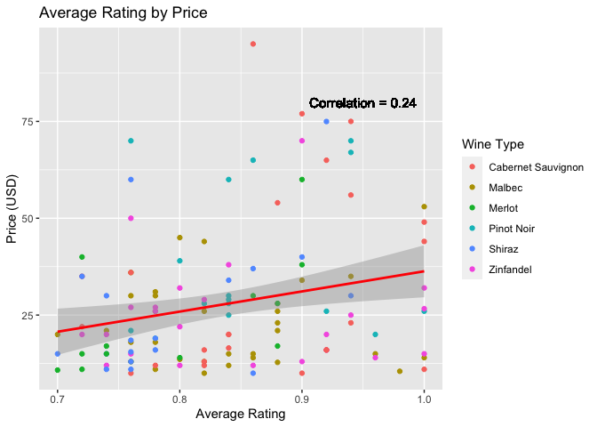
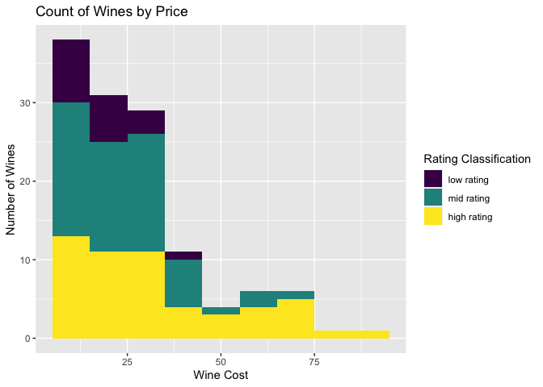
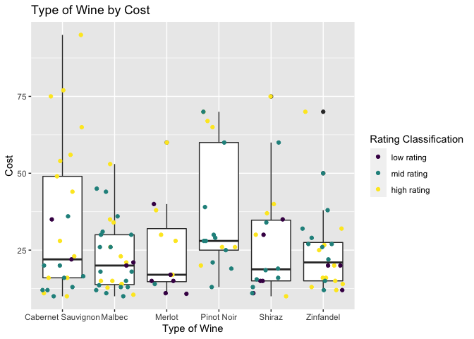
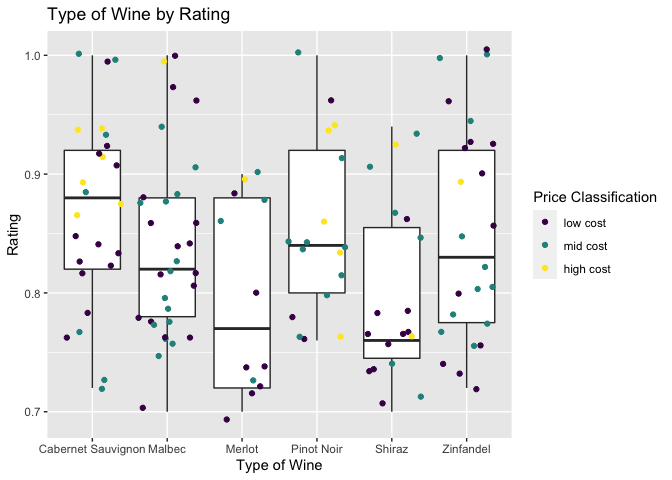
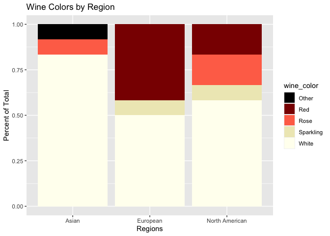
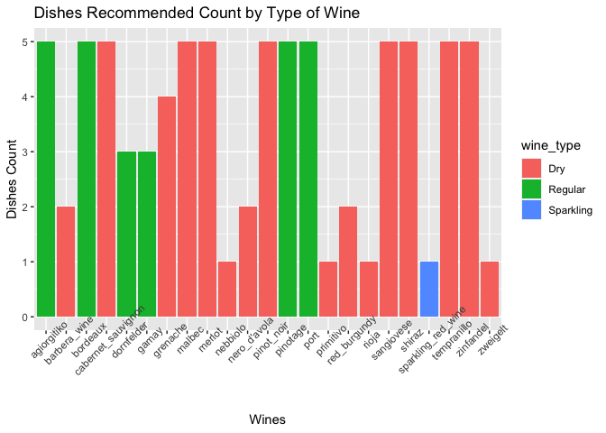
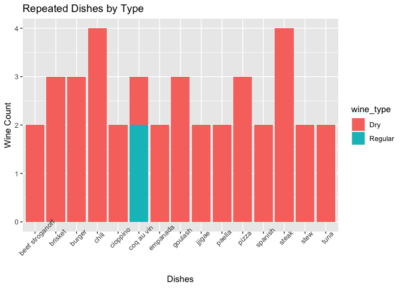

Wine Data API Vignette
================
Annie Brinza & Kara Belknap
2022-10-07

-   [Requirements](#requirements)
-   [API Interaction Functions](#api-interaction-functions)
-   [Exploratory Data Analysis](#exploratory-data-analysis)
-   [Summary](#summary)

This document is a vignette about contacting an API using functions
we’ve created to query, parse, and return well-structured data. We’ll
then use our functions to obtain data from the API and do some
exploratory data analysis. Kara Belknap and Annie Brinza worked on this
project. We decided to use wine data from the food data API.
Specifically, we will be focusing on general wine recommendations, dish
pairings to go with a certain wine, and wine recommendations given a
certain dish. We will be building functions to accomplish all of that.

To interact with these functions, either a general wine type such as
“merlot” needs to be given, or a dish or cuisine type such as “Italian.”
This will be detailed further for each of the API calls.

## Requirements

We used the following packages in the creation of this vignette. The
user will need to install and load these packages in order to interact
with the API.

``` r
library(httr)
library(tidyverse)
library(jsonlite)
```

## API Interaction Functions

In this section, we will define functions to interact with the various
wine APIs found
[here](https://spoonacular.com/food-api/docs#Wine-Guide). We will be
pulling from three different APIs: [Wine
Recommendation](https://spoonacular.com/food-api/docs#Wine-Recommendation),
[Wine Pairing](https://spoonacular.com/food-api/docs#Wine-Pairing), and
[Dish Pairing for
Wine](https://spoonacular.com/food-api/docs#Dish-Pairing-for-Wine).

The APIs do require an API key to access, which can be received by
signing up for a free account. For the free plan, the rate limit is 60
requests in one minute, and a total of 150 requests per day.

### Wine Recommendation Function

This function, `get_wine_recommendations`, will interact with the [Wine
Recommendation
API](https://spoonacular.com/food-api/docs#Wine-Recommendation). The
user will need to input `wine`, which should be a certain type of wine
(valid types given here: [Valid Wine
Types](https://spoonacular.com/food-api/docs#Wine-Guide). The user may
also specify `maxPrice` in USD, `minRating` (a value between 0 and 1,
which corresponds to the number of stars. 0.80 would indicate 4 out of 5
stars.), and `number` which is the max number of results to return (up
to 100).

A dataframe will be returned that has contains the wine recommendations
which meet the inputted parameters.

*Behind the function: First, we wrote a series of if statements to check
the validity of the user inputs along with appropriate error messages in
case of an inappropriate input. If all inputs were valid, we created an
output `API_string` using the paste0 function. Once we have this string,
we run the `GET` function from the `httr` package in order to pull the
data from the API. The raw data is stored as `wine_rec_data`. We then
use `fromJSON` from the `jsonlite` package to convert the data to a user
friendly format. Finally, we store the data of interest in a dataframe
called `wine_recommendations`. This is what is returned by this
function.*

``` r
get_wine_recommendations <- function(wine, maxPrice = 50, minRating = 0.7, number = 10){
  
  api_key <- "80c8e25c825a4a3c93e5cae79f74b48c"
  
  if(is.character(wine) & is.numeric(maxPrice) & is.numeric(minRating) & is.numeric(number)){
      API_string <- paste0("https://api.spoonacular.com/food/wine/recommendation?apiKey=",
                       api_key,"&wine=",wine,"&maxPrice=",maxPrice,"&minRating=",minRating,"&number=",number)
  } else if(is.null(wine)){
    message <- "ERROR - please enter a type of wine from this list: https://spoonacular.com/food-api/docs#Wine-Guide"
    stop(message)
  } else if(!is.character(wine)){
    message <- "ERROR - please enter a string for the type of wine desired from this list: https://spoonacular.com/food-api/docs#Wine-Guide"
    stop(message)
  } else if(!is.numeric(maxPrice)){
    message <- "ERROR - please enter a numeric value for maxPrice"
    stop(message)
  } else if(!is.numeric(minRating)){
    message <- "ERROR - please enter a numeric value between 0 & 1 for minRating"
    stop(message)
  } else if(!is.numeric(number)){
    message <- "ERROR - please enter a numeric value between 1 & 100 for number"
    stop(message)
  }    
    
  wine_rec_data <- GET(API_string)  
  
  if(wine_rec_data$status == 400){
    message <- paste0(wine_rec_data$message, ". Check for typos or try a simpler query")
    message2 <- paste0("If looking for a certain wine, try one of these: https://spoonacular.com/food-api/docs#Wine-Guide")
    final_message <- paste(message, message2, sep = "\n")
    stop(final_message)
  }  

  output_API <- fromJSON(rawToChar(wine_rec_data$content))

  wine_recommendations <- output_API$recommendedWines

  if(length(output_API$recommendedWines) == 0){
    message <- paste0("Sorry, no wines found. Try a different value for maxPrice, minRating, or number.")
    stop(message)
  } 
  
  return(wine_recommendations)
 
}
```

### Wine Pairing Function

This function will interact with the [Wine Pairing
API](https://spoonacular.com/food-api/docs#Wine-Pairing). The user will
need to input `food`, which can be a certain dish such as `steak`, or a
cuisine such as `Italian`. These inputs should be simple - a full recipe
name does not need to be given. A dataframe will be returned that has
the paired wine recommendations. These recommendations can then be used
in combination with the Wine Recommendation Function to find the exact
wine bottle desired.

*Behind the function: First, we wrote a series of if statements to check
the validity of the user inputs along with appropriate error messages in
case of an inappropriate input. If all inputs were valid, we created an
output `API_string` using the paste0 function. Once we have this string,
we run the `GET` function from the `httr` package in order to pull the
data from the API. We then use `fromJSON` from the `jsonlite` package to
convert the data to a user friendly format. Finally, we store the data
of interest in a dataframe called `wine_pairings`. This is what is
returned by this function.*

``` r
get_wine_pairings <- function(food, max_price = NULL){
  # API key generated by us
  api_key <- "a39a52136f9f4544b4fe6a062d255ea4"
  
  # Checking if the food is a valid input
  if(is.character(food)){
      API_string <- paste0("https://api.spoonacular.com/food/wine/pairing?apiKey=",
                       api_key,"&food=",food)
  } else if(is.null(food)){
    message <- "ERROR - please enter a type of dish or cuisine"
    stop(message)
  } else if(!is.character(food)){
    message <- "ERROR - please enter a string for the type of dish or cuisine desired"
    stop(message)
  }
  # Calling the API using the created call
  output_API <- fromJSON(
    API_string
  )
  # Checking to see if the API call failed and returning error message if so
  if(length(output_API$status) > 0){
    message <- paste0(output_API$message, ". Check for typos or try a simpler query")
    message2 <- paste0("If looking for a certain cuisine, try one of these: https://spoonacular.com/food-api/docs#Cuisines")
    final_message <- paste(message, message2, sep = "\n")
    stop(final_message)
  } else if(length(output_API$pairedWines) == 0){
    message <- paste0("Sorry, no paired wines found for ",food,". Try a different dish or cuisine")
    stop(message)
  }
  
  # Creating dataframe of wine pairings
  wine_pairings <- as.data.frame(output_API$pairedWines)
  colnames(wine_pairings) <- "wine_types"
  
  # Returning the wine pairings
  return(wine_pairings)
}
```

### Dish Pairing for Wine

This function will interact with the [Dish Pairing
API](https://spoonacular.com/food-api/docs#Dish-Pairing-for-Wine). The
user will need to input a `wine` they would like a dish recommendation
for, such as `merlot`. The API will return a list of suggested dishes to
go with the wine, such as `burger`.

*Behind the function: First, we wrote a series of if statements to check
the validity of the user inputs along with appropriate error messages in
case of an inappropriate input. If all inputs were valid, we created an
output `API_string` using the paste0 function. Once we have this string,
we run the `GET` function from the `httr` package in order to pull the
data from the API. We then use `fromJSON` from the `jsonlite` package to
convert the data to a user friendly format. Finally, we store the data
of interest in a dataframe called `dish recommendations`. This is what
is returned by this function.*

``` r
get_dish_pairings <- function(wine){
  # API key generated by us
  api_key <- "a39a52136f9f4544b4fe6a062d255ea4"
  
  # Checking if the wine is a valid input
  if(is.character(wine)){
    # Replacing any underscores with spaces so the API works
      if(grepl("_",wine, fixed)){
        wine <- gsub("_", " ", wine)
      }

      API_string <- paste0("https://api.spoonacular.com/food/wine/dishes?apiKey=",
                       api_key,"&wine=",wine)
  } else if(is.null(wine)){
    message <- "ERROR - please enter a type of wine"
    stop(message)
  } else if(!is.character(wine)){
    message <- "ERROR - please enter a string for the type of wine that needs pairing"
    stop(message)
  }
  # Calling the API using the created call
  output_API <- fromJSON(
    API_string
  )
  # Checking to see if the API call failed and returning error message if so
  if(length(output_API$status) > 0){
    message <- paste0(output_API$message, ". Check for typos or try a simpler query.")
    stop(message)
  }
  
  # Creating dataframe of dish recommendations
  dish_recommendations <- as.data.frame(output_API$pairings)
  colnames(dish_recommendations) <- "dishes"
  
  # Returning the dish recommendations
  return(dish_recommendations)
}
```

## Exploratory Data Analysis

One of the reasons we chose the Wine APIs to explore is because we enjoy
drinking wine but don’t know much about it. As a result, we came up with
several questions that we wanted to explore for each of the different
endpoints.

### Wine Recommendation Exploration

The first question we had was “does price really affected the quality of
the wine”. We investigated this using the Wine Recommendation API
function.

*Behind the data: Due to the sheer quantity of wine varietals, we chose
to focus this EDA on only the most popular red wine varietals in the
USA: Cabernet Sauvignon, Pinot Noir, Merlot, Zinfandel, Malbec, and
Shiraz. We started the analysis by obtaining a dataset based on those
wines with the following inputs: Maximum Price of \$100, minimum rating
of 0, and number of wines returned equal to 100. We also filtered wines
with fewer than three user ratings. The following definitions were made
for rating: if a rating was below 0.75, we classified that as “low
rating”, if a rating was between 0.75 and 0.85 we classified it as a
“mid rating”, and if a wine was rated higher than 0.85 we classified
that as a “high rating”. We made similar definitions for price. If a
wine was under \$20, we defined that as “low cost”, if a wine was
between \$20 to \$50 we defined it as “mid cost”, and if the wine was
over \$50 we defined it as “high cost”.*

``` r
red_wines_subset <- c("pinot_noir", "malbec", "zinfandel", "cabernet_sauvignon", "shiraz","merlot")
red_wines_printable <- c("Pinot Noir", "Malbec", "Zinfandel", "Cabernet Sauvignon", "Shiraz","Merlot")

red_wines_rec <- lapply(red_wines_subset, get_wine_recommendations, maxPrice = 100, minRating=0, number=100)
wine_results <- as.data.frame(bind_rows(red_wines_rec, .id = "id"))


wine_results$id <- as.numeric(wine_results$id)
wine_results$price2 <- parse_number(wine_results$price)

wine_results_final <- wine_results %>%
  mutate(wine_type = red_wines_printable[id], 
         ratingClass = as.factor(ifelse(averageRating > 0.85, "high rating", 
                         ifelse(averageRating < 0.75, "low rating", "mid rating"))), 
         priceClass = as.factor(ifelse(price2 > 50, "high cost", 
                        ifelse(price2 < 20, "low cost", "mid cost")))) %>%
  filter(ratingCount > 2)

wine_results_final$ratingClass <- ordered(wine_results_final$ratingClass, levels = c("low rating", "mid rating", "high rating"))
wine_results_final$priceClass <- ordered(wine_results_final$priceClass, levels = c("low cost", "mid cost", "high cost"))
```

In the summary table below, we analyzed the average rating and the
average price for each wine type. We created a new variable called ratio
which looked at the ratio of the average rating over the average price,
which could be used to find wines with better consumer value. In this
particular study, malbec had the highest average rating per average
cost, so you could conclude that on average malbec is a better bargain
than a pinot noir.

``` r
summaryTable <- wine_results_final %>%
  group_by(wine_type) %>%
  summarise(avgRating = mean(averageRating), avgPrice = mean(price2), ratio = avgRating/avgPrice) %>%
  arrange(desc(ratio))
summaryTable
```

    ## # A tibble: 6 × 4
    ##   wine_type          avgRating avgPrice  ratio
    ##   <chr>                  <dbl>    <dbl>  <dbl>
    ## 1 Malbec                 0.837     22.8 0.0368
    ## 2 Zinfandel              0.851     24.6 0.0346
    ## 3 Merlot                 0.797     24.6 0.0323
    ## 4 Shiraz                 0.796     26.9 0.0295
    ## 5 Cabernet Sauvignon     0.869     33.3 0.0261
    ## 6 Pinot Noir             0.853     37.4 0.0228

We looked at calculating the correlation between wine prices and wine
ratings. In this particular analysis, the correlation is around 0.25,
indicating that there is only a weak correlation between cost and
perceived consumer quality.

``` r
correlation <- cor(wine_results_final$price2, wine_results_final$averageRating)
correlation
```

    ## [1] 0.2416304

The following scatter plot looks at the average rating by the average
price for different wine varietals. You may expect a strong correlation
between rating and cost, but you can see that highly rated wines can be
found across all price points.

``` r
myScatterPlot <- ggplot(wine_results_final, aes(x=averageRating, y = price2))
myScatterPlot + geom_point(aes(color=wine_type)) +
  geom_smooth(method = lm, color = "Red") + 
  geom_text(x = 0.95, y = 80, size = 4, label = paste0("Correlation = ", round(correlation, 2))) + 
  labs(x="Average Rating", y="Price (USD)", title = "Average Rating by Price") +
  guides(color = guide_legend("Wine Type")) 
```

    ## `geom_smooth()` using formula 'y ~ x'

<!-- -->

The following graph shows the number of wines in our analysis as a
function of cost. This is also color-coded by the number of wines in the
“low rating”, “mid rating”, and “high rating” classifications that we
defined above.

``` r
myHistogram <- ggplot(wine_results_final, aes(x = price2,  fill = ratingClass))
myHistogram + geom_histogram(binwidth = 10) +
  labs(x = "Wine Cost", y = "Number of Wines", title = "Count of Wines by Price") + 
  guides(fill = guide_legend("Rating Classification"))
```

<!-- -->

Finally, we compared wine types by cost and rating. In the first plot,
we can see that pinot noir has the highest average cost but also the
highest spread. In the second plot, wine type by rating, we can see that
there is a wide range across all varietals, but merlot and zinfandel
lead the way in variance. Cabernet Sauvignon has the highest overall
average rating for the wines that we investigated.

``` r
myBoxPlot <- ggplot(wine_results_final, aes(x = wine_type, y = price2))
myBoxPlot + geom_boxplot() + 
  geom_jitter(aes(color = ratingClass)) + 
  labs(x = "Type of Wine", y = "Cost", title = "Type of Wine by Cost") + 
  guides(color = guide_legend("Rating Classification"))
```

<!-- -->

``` r
myBoxPlot <- ggplot(wine_results_final, aes(x = wine_type, y = averageRating))
myBoxPlot + geom_boxplot() + 
  geom_jitter(aes(color = priceClass)) + 
  labs(x = "Type of Wine", y = "Rating", title = "Type of Wine by Rating") + 
  guides(color = guide_legend("Price Classification"))
```

<!-- -->

### Wine Pairings Exploration

The next investigation was into wine pairings. In this case, there is a
lot that could possibly be looked at and so we needed to narrow down our
focus. We decided to look at wine recommendations across several
different cuisines to see differences there. We chose cuisines from
several different continents because we were also curious as to whether
any wine recommendations would be similar within the same regions.

``` r
cuisine_list <- c("Italian", "Greek", "French", "Spanish", "Indian", "Korean", 
                  "Japanese",  "Thai", "Southern","Mexican", "Caribbean", "Cajun")
wine_pairings_list <- lapply(cuisine_list, get_wine_pairings)
wine_pairings_df <- as.data.frame(do.call(cbind, wine_pairings_list))
colnames(wine_pairings_df) <- cuisine_list

# Going to reshape the data into long format so that it is easier to work with
wine_pairings_long <- pivot_longer(wine_pairings_df, cols = everything())
colnames(wine_pairings_long) <- c("cuisine", "wine")

# Now need to create a new variable that is the region associated with each cuisine
wine_pairings_long <- wine_pairings_long %>% 
  mutate(region = ifelse(cuisine %in% c("Italian", "Greek", "French", "Spanish"),
                         "European", ifelse(cuisine %in% c("Indian", "Korean",
                          "Thai", "Japanese"), "Asian", "North American")))
```

In order to see if regions had similar wine recommendations, we made a
contingency table to see the counts of wine by region.

``` r
# Creating the contingency table
table(wine_pairings_long$region, wine_pairings_long$wine)
```

    ##                 
    ##                  agiorgitiko albarino assyrtiko bordeaux champagne chenin blanc chianti gewurztraminer grenache
    ##   Asian                    0        0         0        0         0            2       0              2        0
    ##   European                 1        1         1        1         1            0       1              0        1
    ##   North American           0        1         0        0         0            0       0              1        0
    ##                 
    ##                  gruener veltliner moschofilero pinot gris pinot noir riesling rose wine sake sauvignon blanc
    ##   Asian                          1            0          0          0        4         0    1               1
    ##   European                       0            1          0          0        0         0    0               0
    ##   North American                 0            0          1          1        3         1    0               1
    ##                 
    ##                  sparkling rose sparkling wine tempranillo trebbiano verdicchio white burgundy zinfandel
    ##   Asian                       1              0           0         0          0              0         0
    ##   European                    0              0           1         1          1              1         0
    ##   North American              1              1           0         0          0              0         1

As we can see in the contigency table, there are some wines that are
similar across the regions. Riesling is popular both in Asian and North
American cuisine. Gewurztraminer and chenin blanc are both similar
across Asian cuisines. This makes us wonder - is white wine in general
more popular in Asian cuisines?

In order to investigate this question, we created a new variable called
`wine_color` to classify wine as red, white, or sparkling to see a
broader pattern.

``` r
# Now going to create a wine color variable to see if red or white is more popular in each
# region
wine_pairings_long <- wine_pairings_long %>% 
  mutate(wine_color = ifelse(wine %in% c("agiorgitiko", "bordeaux", "grenache",
                      "pinot noir", "tempranillo", "zinfandel", "chianti"), "Red", 
                      ifelse(wine %in% c("albarino", "assyrtiko", "chenin blanc",
                      "gewurztraminer", "gruener veltliner", "moschofilero", 
                      "pinot gris", "riesling", "sauvignon blanc", "trebbiano",
                      "verdicchio", "white burgundy"), "White", ifelse(wine %in%
                       c("champagne", "sparkling wine"), "Sparkling", ifelse(wine %in%
                       c("rose wine", "sparkling rose"), "Rose", "Other")))))

# Now looking at wine color by region using a barplot
g <- ggplot(wine_pairings_long, aes(x = region))
g + geom_bar(aes(fill = wine_color), position = "fill") + labs(x = "Regions", y = "Percent of Total", title = "Wine Colors by Region") + scale_fill_manual(values = c("black","darkred", "coral1", "lemonchiffon2", "ivory"))
```

<!-- -->

We can see from the plot that yes, Asian cuisine mainly ends up with
recommendations of white wine. In fact, no red wine is recommended for
Asian cuisine at all. On the other hand, European cuisine has the
highest proportion of red wines out of all the regions, at almost 50%.
North American cuisine has the widest variety of wine colors
recommended, but white is still the majority.

### Dish Recommendation Exploration

The next investigation was into dish recommendations - we were curious
about the differences in dishes recommended across sub-varieties of
wine. We wanted to know if there were certain dishes a merlot, for
example, paired better with than a pinot noir. In order to accomplish
this, we used the [Wine
Guide](https://spoonacular.com/food-api/docs#Wine-Guide) to create a
list of all the red wines (since we tend to drink more red than white)
and made function calls for all of those wines. Not all wines had
recommendations, so we simplified the list to include only those that
did. We merged that data together so that it could be explored.

``` r
# List of all the red wines
red_wines <- c("zweigelt",  "barbera_wine", "primitivo", "pinot_noir", "nebbiolo",
               "red_burgundy", "rioja",  "grenache", "malbec", "zinfandel", "sangiovese",
               "cabernet_sauvignon", "tempranillo", "shiraz","merlot", "nero_d'avola",
               "bordeaux", "port", "gamay", "dornfelder", "sparkling_red_wine", 
               "pinotage", "agiorgitiko")

red_wines_list <- lapply(red_wines, get_dish_pairings)
# Associating the dishes with the wines
names(red_wines_list) <- red_wines

# Now we need to reshape the data to see for each wine
# Going to have it in long format for easier EDA
red_wines_df <- as.data.frame(unlist(red_wines_list))
red_wines_df <- red_wines_df %>%
  rownames_to_column("wine_original") %>%
    separate(col = wine_original, into = c("wine", "dishes"), sep = "\\.") %>%
      rename(dish = `unlist(red_wines_list)`) %>%
        select("wine", "dish")
```

We decided to create a contingency table to see how frequently each dish
is recommended. This will help us answer our original question, are
dishes truly different across wine varieties?

``` r
# Creating a contingency table
table(red_wines_df$dish)
```

    ## 
    ##                 african              baked ziti        beef bourguignon               beef ribs 
    ##                       1                       1                       1                       1 
    ##         beef stroganoff                 bobotie                 brisket              bunny chow 
    ##                       2                       1                       3                       1 
    ##                  burger        chicken parmesan                   chili                 cholent 
    ##                       3                       1                       4                       1 
    ##                cioppino                     cod              coq au vin                empanada 
    ##                       2                       1                       3                       2 
    ##                    fish                  french       french onion soup                  german 
    ##                       1                       1                       1                       1 
    ##                 goulash                   greek                   gyros                    hake 
    ##                       3                       1                       1                       1 
    ##               hand pies                 italian                  jjigae             jollof rice 
    ##                       1                       1                       2                       1 
    ##                 lasagne     macaroni and cheese                meatloaf                moussaka 
    ##                       1                       1                       1                       1 
    ##              onion tart                  paella          pastry pillows       piri piri chicken 
    ##                       1                       2                       1                       1 
    ##                   pizza               prime rib                  quiche             ratatouille 
    ##                       3                       1                       1                       1 
    ##                rib tips                rouladen               schnitzel                    sole 
    ##                       1                       1                       1                       1 
    ##                 souffle         souffle dessert                southern                souvlaki 
    ##                       1                       1                       1                       1 
    ##              soy burger spaghetti and meatballs             spanakopita                 spanish 
    ##                       1                       1                       1                       2 
    ##                   steak                    stew                    tuna          turkey burgers 
    ##                       4                       2                       2                       1 
    ##                turnover 
    ##                       1

It looks like only a few of the dishes are frequently recommended, so
yes - different wine varieties will result in different recommendations.

This naturally leads us to ask the next question - do different types of
wine result in different counts of dishes recommended? And does this
differ by subtype of red wine?

``` r
# Creating a barplot to see how many dishes were recommended per type of wine
# First creating a new column for type of wine
red_wines_df <- red_wines_df %>% 
  mutate(wine_type = ifelse(wine %in% c("bordeaux", "port", "gamay", "dornfelder", "pinotage",
                                    "agiorgitiko"), "Regular", 
                        ifelse(wine == "sparkling_red_wine", "Sparkling", "Dry")))
# Creating the barplot
g <- ggplot(red_wines_df, aes(x = wine))
g + geom_bar(aes(fill = wine_type)) + labs(x = "Wines", y = "Dishes Count", title = "Dishes Recommended Count by Type of Wine") + theme(axis.text.x = element_text(angle = 45))
```

<!-- --> Looking at the
barplot, it looks like regular red wines have a higher average dish
count. However, looks can be deceiving so we should confirm this theory
using actual numbers.

``` r
# Looking at just average count by wine type
grouped_wines_df <- red_wines_df %>%
  count(wine) %>%
  mutate(wine_type = ifelse(wine %in% c("bordeaux", "port", "gamay", "dornfelder", "pinotage",
                            "agiorgitiko"), "Regular", ifelse(wine == 
                            "sparkling_red_wine", "Sparkling", "Dry"))) %>%
  group_by(wine_type) %>%
  summarise(mean_dishes = mean(n))

print(grouped_wines_df)
```

    ## # A tibble: 3 × 2
    ##   wine_type mean_dishes
    ##   <chr>           <dbl>
    ## 1 Dry              3.38
    ## 2 Regular          4.33
    ## 3 Sparkling        1

It is clear that regular wines do have a higher number of dishes
recommended. This makes sense given that they are probably more popular
than dry wines, and also have a less sharp taste so could go with a
wider variety of food.

One last question to investigate is - how many dishes are in common
across similar wine types? From the contigency table, we saw that chili
and steak were the most recommended at 4 wines each. Are these wines of
the same type?

``` r
# Creating repeated dishes df
repeated_dishes <- red_wines_df %>% 
  count(dish) %>%
  subset(n > 1)

red_wines_repeated <- red_wines_df %>% subset(dish %in% repeated_dishes$dish)

g <- ggplot(red_wines_repeated, aes(x = dish))
g + geom_bar(aes(fill = wine_type)) + labs(x = "Dishes", y = "Wine Count", title = "Repeated Dishes by Type") + theme(axis.text.x = element_text(angle = 45))
```

<!-- -->
Chili and steak were all recommended for dry wine types. As we can see
by the graph, all except for coq au vin have the same wine type that
generated the recommendation. Interestingly, all the repeat recommended
dishes come from in the dry category, even though the regular red wines
had a lower average number of dishes recommended in general.

## Summary

To summarize everything we did in this vignette, we built functions to
reach out to three different Wine APIs. We then retrieved data using
these functions, and did some exploratory data analysis to identify
patterns in the data and answer some questions that we had. We created
tables, graphs, and created new variables during the EDA. One of the
most interesting things we found is that there is a very low correlation
between the price and rating of a wine. We also found that Asian cuisine
results in white wine recommendation mainly, while European cuisine is
on the other end of that spectrum.

We hope these APIs help anyone who wants a wine recommendation, a dish
recommendation, or a suggestion for a wine pairing based off of the dish
they are making!
